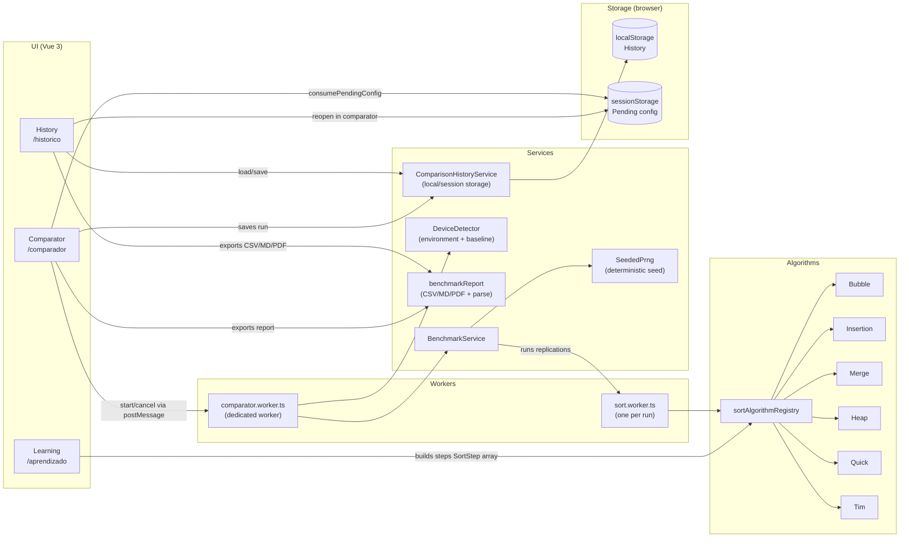
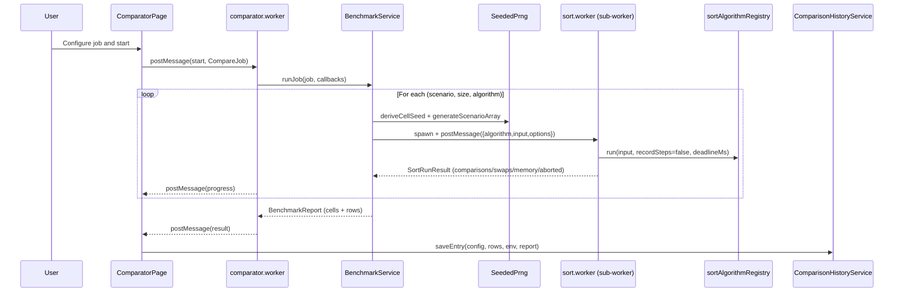

# Sorting Lab — Interactive Sorting Algorithms Simulator

A browser-only web app to **learn** and **compare** sorting algorithms in a visual and reproducible way.

- **Learning**: step-by-step animation + pseudocode + internal variables (i/j/pivot).
- **Comparator**: benchmark across scenarios, sizes and replications, with timeout and outlier removal.
- **History**: local persistence, re-open runs, and exports (CSV/Markdown/PDF/PNG).

> Versão em português: veja `README.md`.

## Who is this for?

This project is intentionally documented to work for different stakeholders:

- **Non-technical users**: understand “what the algorithm is doing” visually.
- **Students**: connect behavior to $O(\cdot)$ and see variables changing.
- **Teachers**: a practical lab tool with reproducible experiments.
- **Engineers / researchers**: seeded inputs for fairness, Web Workers, timeouts, IQR outlier trimming.

## Running locally

Prerequisites: Node.js (LTS) + npm.

```bash
npm install
npm run dev
```

Other scripts:

```bash
npm run build
npm run preview
npm run test
npm run test:run
```

## The project in one minute (screens + architecture)

Sorting Lab is a Vue 3 SPA with three routes:

- `/aprendizado` → step-by-step visualization (produces `SortStep[]`).
- `/comparador` → asynchronous benchmarks (Web Worker + sub-workers).
- `/historico` → persists and re-opens runs; exports/imports reports.

### Diagram: how the 3 screens connect



## Module 1 — Learning (`/aprendizado`)

Goal: understand the algorithm **while it runs**, not only its final output.

### User inputs

- **Algorithm** (Insertion, Bubble, Merge, Heap, Quick).
- **Input**:
  - *Generated*: scenario (**ascending**, **descending**, **random**) + size (up to **30** for readability).
  - *Manual*: list of numbers (comma/semicolon/space separated).
- **Speed**: 1× to 10×.

### What happens under the hood

1. The page calls `sortAlgorithmRegistry[algorithm].run(array)` with `recordSteps=true`.
2. Each algorithm returns a `SortRunResult` with `steps: SortStep[]`.
3. The UI plays those `steps` with `setInterval`, showing:
   - bars (values) + indices starting at **1**;
   - highlights (`activeIndexes`) and algorithm-specific markers (e.g. pivot);
   - variable panel (`i`, `j`, `pivot`, etc.) and metrics (playback time, comparisons, swaps).

> For benchmarking, step recording is disabled (`recordSteps=false`) to avoid overhead.

## Module 2 — Comparator (`/comparador`)

Goal: compare **average performance** (time) and behavior (comparisons/swaps/estimated aux memory) across algorithms.

### Benchmark configuration

- Algorithms (includes **TimSort** in the comparator).
- Scenarios: ascending / descending / random.
- Sizes: preset list (from 10 up to 200,000).
- Replications per cell.
- Base seed (reproducibility).
- Outlier removal (optional) via IQR.
- Per-run timeout (optional) per replication.

### Async execution (why two worker levels?)

- The UI uses a **dedicated worker** (`comparator.worker.ts`) so the main thread stays responsive.
- The comparator uses a **sub-worker per sort run** (`sort.worker.ts`) to:
  - make cancellation cheap (terminate the worker);
  - avoid a stuck run blocking the rest.

### Diagram: benchmark sequence



### Fairness and reproducibility

For each **cell** (algorithm × scenario × size) and each **replication**, the input array is generated deterministically:

- `SeededPrng.deriveCellSeed(baseSeed, scenario, size, rep)`
- `SeededPrng.generateScenarioArray(size, scenario, cellSeed)`

This ensures **all algorithms receive the same base array** for the same replication (fair comparison).

### Outliers and timeouts

- **Timeout**: when enabled, each replication receives a `deadlineMs`. If the run exceeds it, the algorithm returns `aborted=true`.
- **Outliers (IQR)**: when enabled, removes durations outside $[Q1-1.5\cdot IQR,\ Q3+1.5\cdot IQR]$.
  - Note: IQR trimming applies to **durations**; comparisons/swaps/memory are averaged across valid (non-timeout) samples.

## Module 3 — History (`/historico`)

Goal: keep, revisit, and share benchmark executions.

### What is saved

Each `ComparisonHistoryEntry` stores:

- configuration (`CompareJob`),
- aggregated rows (`rows`),
- (when available) full report (`BenchmarkReport`) and environment (`BenchmarkEnvironment`).

### Actions

- **Favorite** runs (protected during quota eviction).
- **Delete** a run or **clear** history (favorites are kept).
- **Export**:
  - CSV (with `# section:<name>` markers),
  - Markdown,
  - PDF,
  - chart PNG.
- **Import CSV**: rebuilds a `BenchmarkReport` via `benchmarkReport.parseCsvReport`.
- **Reopen in comparator**: stores the config in `sessionStorage` and navigates to `/comparador`.

## Services and responsibilities (summary)

- `sortAlgorithmRegistry`: central algorithm registry (`AlgorithmKey` → `run`).
- `BenchmarkService`: runs the benchmark (cells/replications), applies timeout/IQR, builds `BenchmarkReport`.
- `SeededPrng`: deterministic scenario arrays for fairness.
- `DeviceDetector`: captures environment and computes a baseline.
- `benchmarkReport`: generates Markdown/PDF/CSV and parses imported CSV.
- `ComparisonHistoryService`: persists history (localStorage), pending config (sessionStorage), favorites and quota policy.
- `comparator.worker.ts`: drives benchmark off the main thread and streams progress/results.
- `sort.worker.ts`: runs a single algorithm in isolation.

## Metric interpretation

- **Time (ms)**: per-cell mean over valid replications (timeouts excluded).
- **Comparisons / swaps**: per-cell means over valid replications.
- **Aux memory (KB)**: an *estimate* derived from the implementation (e.g., copies/stack). Not a real browser heap measurement.
- **Timeouts**: number of aborted replications in the cell.
- **Environment**: baseline score contextualizes results across different machines.

## Adding a new algorithm

Minimum checklist:

1. Implement `src/algorithms/<new>.ts` returning `SortRunResult`.
2. Add a key to `AlgorithmKey` (`src/types/comparator.ts`).
3. Register it in `src/services/sort-algorithm-registry.ts`.
4. Add it to `src/constants/comparator-options.ts`.
5. Add tests under `__tests__/algorithms/`.

Optional (Learning): add metadata in `src/constants/learningAlgorithms.ts` and i18n texts.

## Detailed specification

- Full spec (pt-BR): `docs/ERS.md`
- Full spec (en-US): `docs/ERS.en-US.md`
