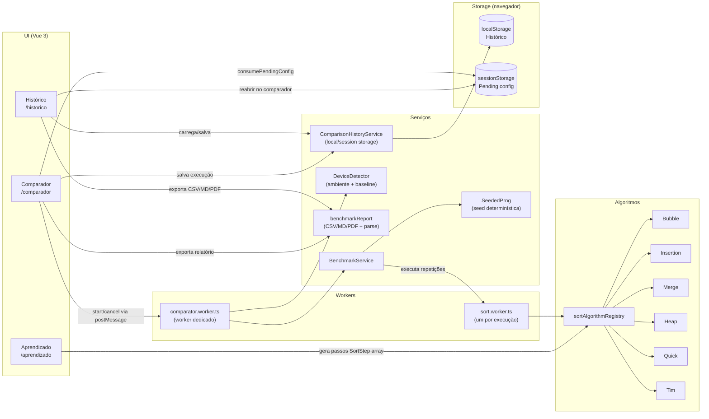
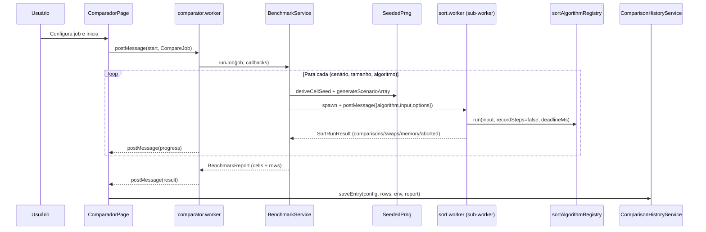

# Sorting Lab — Simulador Iterativo de Algoritmos de Ordenação

Uma aplicação web (100% no navegador) para **aprender** e **comparar** algoritmos de ordenação de forma visual e reproduzível.

- **Aprendizado**: animação passo a passo + pseudocódigo + variáveis internas (i/j/pivot).
- **Comparador**: benchmark com cenários, tamanhos, replicações, timeout e remoção de outliers.
- **Histórico**: persistência local, reabertura de simulações e exportações (CSV/Markdown/PDF/PNG).

> English version: see `README.en-US.md`.

## Para quem é

Este projeto foi escrito para ser útil em diferentes níveis:

- **Leigos / curiosos**: “como o algoritmo mexe nos números” (passo a passo).
- **Estudantes**: comparar estratégias, visualizar variáveis e relacionar com $O(\cdot)$.
- **Professores**: material prático para aula/laboratório com exemplos reproduzíveis.
- **Engenheiros / cientistas**: benchmark controlado por seed, com worker, timeout e IQR.

## Como rodar

Pré-requisitos: Node.js (LTS) + npm.

```bash
npm install
npm run dev
```

Outros comandos:

```bash
npm run build
npm run preview
npm run test
npm run test:run
```

## Testes unitários

Os testes unitários (Vitest) são a principal garantia contra regressões no núcleo do simulador — algoritmos, benchmark e serviços.

O que eles validam (resumo):

- **Correção da ordenação**: cada algoritmo ordena em **ordem crescente** para entradas comuns (vazio, duplicatas, já ordenado, reverso).
- **Imutabilidade**: os algoritmos não mutam o array original.
- **Contrato de passos (Aprendizado)**: `SortStep` sempre contém campos obrigatórios (valores, índices ativos, variáveis, contadores e campos específicos como pivot no QuickSort).
- **Modo benchmark (Comparador)**: `recordSteps=false` retorna `steps=[]` (sem overhead), e o algoritmo respeita `AbortSignal`/`deadlineMs`.
- **Reprodutibilidade e “justiça”**: mesma seed → resultados agregados consistentes; seeds diferentes → permutações e métricas variam como esperado.
- **Timeout/outliers**: timeouts são contabilizados sem travar a fila; IQR remove outliers de duração quando habilitado.
- **Exportação/importação**: CSV tem seções obrigatórias, faz round-trip `generate → parse` e é **independente do idioma**.
- **Histórico**: SSR guard (sem `window`), limites de histórico, favoritos, pending config e comportamento em storages nulos/malformados.

Onde ficam:

- `__tests__/algorithms/*` — correção, estrutura de passos e abort/deadline.
- `__tests__/services/*` — PRNG (seed), benchmark, relatórios, histórico e registry.

Como rodar:

```bash
npm run test       # watch
npm run test:run   # execução única
npx vitest run --coverage
```

> Cobertura: `vitest.config.ts` define módulos-alvo e thresholds de 100% (quando rodado com cobertura), protegendo algoritmos e serviços críticos.

> Observação: não há suíte E2E; a cobertura atual é focada em lógica (algoritmos/serviços) e contratos de dados.

## O projeto em 1 minuto (arquitetura + telas)

O Sorting Lab é uma SPA em Vue 3 com três rotas:

- `/aprendizado` → visualização passo a passo (gera `SortStep[]`).
- `/comparador` → executa benchmarks assíncronos (Web Worker + sub-workers).
- `/historico` → persiste e reabre execuções; exporta/importa relatórios.

### Diagrama: como as 3 telas se correlacionam



## Módulo 1 — Aprendizado (`/aprendizado`)

Objetivo: **entender o algoritmo executando**, não “só ver o resultado”.

### O que o usuário configura

- **Algoritmo** (Insertion, Bubble, Merge, Heap, Quick).
- **Entrada**:
	- *Gerada*: cenário (**crescente**, **decrescente**, **aleatório**) e tamanho (até **30** para manter a animação legível).
	- *Manual*: lista de números (separados por vírgula, ponto-e-vírgula ou espaços).
- **Velocidade**: 1× a 10×.

### O que acontece por baixo

1. A página chama `sortAlgorithmRegistry[algoritmo].run(vetor)` com `recordSteps=true`.
2. Cada algoritmo retorna um `SortRunResult` com `steps: SortStep[]`.
3. A UI reproduz `steps` com `setInterval`, exibindo:
	 - barras (valores) + índices **começando em 1**;
	 - destaques de `activeIndexes` e, quando aplicável, `pivotIndex` e marcadores específicos;
	 - painel de variáveis (`i`, `j`, `pivot`, etc.) e métricas (tempo de reprodução, comparações, swaps).

> Para benchmark, a aplicação desliga a gravação de passos (`recordSteps=false`) para reduzir overhead.

## Módulo 2 — Comparador (`/comparador`)

Objetivo: **comparar desempenho médio** (tempo) e comportamento (comparações/trocas/memória auxiliar estimada) entre algoritmos em diferentes cenários.

### Configuração do benchmark

- Algoritmos (inclui **TimSort** no comparador).
- Cenários: crescente / decrescente / aleatório / quase-ordenado / quase-decrescente / gaussiano / organ-pipe / com-outliers.
- Tamanhos: lista de presets (de 10 até 200.000).
- Replicações por célula.
- Seed base (para reprodutibilidade).
- Permitir duplicatas (opcional) — `aleatorio` usa amostragem com reposição em vez de permutação.
- Remoção de outliers (opcional) via IQR.
- Timeout por execução (opcional) por replicação.

### Execução assíncrona (por que dois níveis de worker?)

- A UI cria um **worker dedicado** (`comparator.worker.ts`) para não travar a thread principal.
- O comparador usa um **sub-worker por execução** (`sort.worker.ts`) para:
	- permitir cancelamento barato (terminar o worker);
	- evitar que uma execução “travada” bloqueie as demais.

### Diagrama: sequência do benchmark



### “Justiça” e reprodutibilidade

Para cada **célula** (algoritmo × cenário × tamanho) e para cada **replicação**, o vetor de entrada é gerado por seed determinística:

- `SeededPrng.deriveCellSeed(baseSeed, scenario, size, rep)`
- `SeededPrng.generateScenarioArray(size, scenario, cellSeed)`

Assim, **todos os algoritmos competem com o mesmo vetor base** na mesma replicação (fair comparison).

### Outliers e timeouts

- **Timeout**: quando habilitado, cada replicação recebe um `deadlineMs`. Se o algoritmo ultrapassar, ele marca `aborted=true`.
- **Outliers (IQR)**: quando habilitado, remove tempos fora das cercas $[Q1-1.5\cdot IQR,\ Q3+1.5\cdot IQR]$.
	- Importante: a remoção por IQR é aplicada às **durações**; comparações/trocas/memória são médias das amostras válidas (não-timeout).

## Módulo 3 — Histórico (`/historico`)

Objetivo: guardar, comparar e compartilhar execuções.

### O que fica salvo

Cada item do histórico (`ComparisonHistoryEntry`) armazena:

- configuração (`CompareJob`),
- resultados agregados (`rows`),
- (quando disponível) relatório completo (`BenchmarkReport`) + ambiente (`BenchmarkEnvironment`).

### O que dá pra fazer

- **Favoritar** execuções (protege contra descarte quando faltar quota).
- **Excluir** uma execução ou **limpar** histórico (mantém favoritos).
- **Exportar**:
	- CSV (com seções `# section:<nome>`),
	- Markdown,
	- PDF,
	- PNG do gráfico.
- **Importar CSV**: reconstrói um `BenchmarkReport` com `benchmarkReport.parseCsvReport`.
- **Reabrir no comparador**: salva a config em `sessionStorage` e navega para `/comparador`.

## Serviços e responsabilidades (resumo)

- `sortAlgorithmRegistry`: registry único de algoritmos (`AlgorithmKey` → `run`).
- `BenchmarkService`: executa o benchmark (células/replicações), faz timeout, IQR, monta `BenchmarkReport`.
- `SeededPrng`: gera vetores de entrada determinísticos por cenário/tamanho/replicação.
- `DeviceDetector`: captura ambiente (SO, browser, threads, memória estimada, GPU) e mede baseline.
- `benchmarkReport`: gera Markdown/PDF/CSV e faz parse do CSV importado.
- `ComparisonHistoryService`: persiste histórico (localStorage), pendência de reabertura (sessionStorage), favoritos e política de quota.
- `comparator.worker.ts`: coordena benchmark fora da UI e publica progresso/resultado.
- `sort.worker.ts`: executa 1 algoritmo em isolamento (sub-worker).

## Interpretação das métricas (para diferentes públicos)

- **Tempo (ms)**: média do tempo por célula (replicações válidas; timeouts não entram na média).
- **Comparações / trocas**: médias por célula (replicações válidas).
- **Memória auxiliar (KB)**: *estimativa* baseada na implementação (ex.: cópias auxiliares/stack). Não é medição real do heap do browser.
- **Timeouts**: quantidade de replicações abortadas na célula.
- **Ambiente**: o baseline ajuda a contextualizar máquinas diferentes (não “corrige” automaticamente os resultados).

## Como adicionar um algoritmo novo

Checklist (mínimo):

1. Implementar em `src/algorithms/<novo>.ts` retornando `SortRunResult`.
2. Adicionar a key em `AlgorithmKey` (`src/types/comparator.ts`).
3. Registrar em `src/services/sort-algorithm-registry.ts`.
4. Incluir em `src/constants/comparator-options.ts` (para aparecer no comparador).
5. Criar testes em `__tests__/algorithms/`.

Opcional (Aprendizado): incluir metadata em `src/constants/learningAlgorithms.ts` + textos i18n.

## Especificação detalhada

- Documento completo (pt-BR): `docs/ERS.md`
- Documento completo (en-US): `docs/ERS.en-US.md`
