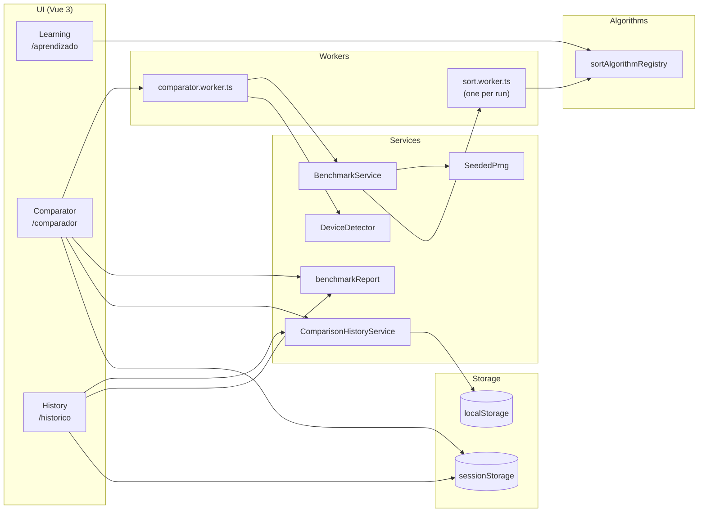

# SRS — Software Requirements Specification (Sorting Lab)

- Project: **Sorting Lab — Interactive Simulator**
- Date: 2026-05-15
- Language: en-US

## 1. Overview

### 1.1 Purpose

Sorting Lab is a browser-only web application designed to:

1. **Teach sorting algorithms** through step-by-step animations, pseudocode, and internal variables.
2. **Compare algorithms** via reproducible benchmarks (seeded input), metrics, and off-main-thread execution.
3. **Store, reopen, and export** benchmark runs for sharing and progress tracking.

### 1.2 Target audience (stakeholders)

- **Learning users**: students and curious learners.
- **Benchmark users**: teachers, developers, researchers.
- **Maintainers**: contributors adding algorithms, adjusting metrics, evolving UI/architecture.

### 1.3 Scope

The application is organized into three modules/screens (routes):

- M1 — Learning: `/aprendizado`
- M2 — Comparator: `/comparador`
- M3 — History: `/historico`

Out of scope:

- Backend/server and authentication (everything runs locally).
- Remote persistence.
- “True” browser memory measurement (reported memory is an **estimate** of auxiliary memory used by the implementation).

### 1.4 Tech stack

- UI: Vue 3 + TypeScript (strict) + Vite
- Design system: Ant Design Vue 4
- Charts: Chart.js via vue-chartjs
- PDF: jsPDF (lazy import)
- i18n: vue-i18n (pt-BR / en-US / es-ES)
- Concurrency: Web Workers
- Tests: Vitest + coverage (100% thresholds for targeted modules)

## 2. Definitions and glossary

- **Algorithm**: a sorting implementation accessible via a key (`AlgorithmKey`).
- **Scenario** (`ScenarioType`): input distribution:
  - `crescente`: [1..n]
  - `decrescente`: [n..1]
  - `aleatorio`: deterministic Fisher-Yates shuffle with seed
- **Cell**: (algorithm × scenario × size) unit in a benchmark.
- **Replication**: an independent repetition inside a cell.
- **Base seed**: user-provided number used as root to derive per-cell/per-replication seeds.
- **Timeout**: max allowed time per replication; when exceeded, the replication is aborted.
- **Outlier**: a duration sample removed via IQR (Tukey 1.5×IQR) when enabled.
- **Step** (`SortStep`): snapshot of array state and internal variables used for Learning animations.
- **Baseline score**: ms spent running a fixed loop, used to contextualize device performance.

## 3. System architecture

### 3.1 Macro view

The app is a SPA with three routes and a benchmark pipeline designed not to freeze the UI.

### 3.2 Decision: dedicated worker + per-run sub-worker

**Motivation**

- Long-running JS benchmarks can block the main thread and freeze the interface.
- Even inside a worker, a run may take too long; cooperative abort checks are periodic, not instantaneous.

**Implemented solution**

- `comparator.worker.ts` orchestrates the job (start/cancel/progress/result).
- `BenchmarkService` runs inside that worker and calls the algorithm registry.
- In the comparator, the registry is swapped to `createSubWorkerRegistry()`, running each sort inside a new `sort.worker.ts`.

**Trade-offs**

- Additional worker creation overhead, in exchange for robustness and better UX.

### 3.3 Data contracts (main types)

- `SortRunResult`: `finalArray`, counters (`comparisons`, `swaps`), `peakAuxBytes` (estimate), `aborted`.
- `SortStep`: snapshots with `values`, `activeIndexes`, `variables`, plus algorithm-specific fields (pivot, heap region, TimSort runs, etc.).
- `CompareJob`: benchmark configuration (algorithms, scenarios, sizes, replications, seed, timeout, outliers).
- `BenchmarkCell`: raw samples + per-cell means.
- `BenchmarkReport`: full report with `cells`, `rows` and (optional) `environment`.
- `ComparisonHistoryEntry`: persisted history entry with `config`, `rows`, `report` and metadata.

## 4. Requirements

### 4.1 Module 1 — Learning

**User stories**

- US-M1-01: As a student, I want to watch the algorithm sort step-by-step to understand the process.
- US-M1-02: As a student, I want to control speed and pause/resume to follow along.
- US-M1-03: As an instructor, I want the UI to show internal variables and pseudocode to connect theory and practice.

**Functional requirements (FR)**

- FR-M1-01: List available algorithms.
- FR-M1-02: Allow generated inputs by scenario (ascending/descending/random) with a visualization limit.
- FR-M1-03: Allow manual input (text with common separators).
- FR-M1-04: Run and display step-by-step animation from `SortStep[]`.
- FR-M1-05: Execution controls: start, pause, resume, reset, and step navigation (back/forward).
- FR-M1-06: Speed control from 1× to 10×.
- FR-M1-07: Display indices starting at 1.
- FR-M1-08: Display internal variables (e.g., i/j/pivot) per step.
- FR-M1-09: Display basic metrics during/after playback (playback time, comparisons, swaps).
- FR-M1-10: Display algorithm description (concept/strategy) and asymptotic complexities (best/avg/worst).

**Acceptance criteria (AC)**

- AC-M1-01: For any valid input, the final array displayed must be in ascending order.
- AC-M1-02: Changing speed must affect the playback rate without breaking step ordering.
- AC-M1-03: Pause/resume must preserve the current step and keep metrics consistent.

### 4.2 Module 2 — Comparator

**User stories**

- US-M2-01: As an advanced user, I want to compare algorithms across multiple scenarios and sizes.
- US-M2-02: As a researcher, I want reproducible results with seeds and equivalent inputs.
- US-M2-03: As a user, I want to cancel/limit long executions without freezing the UI.

**Functional requirements (FR)**

- FR-M2-01: Select 1+ algorithms.
- FR-M2-02: Select 1+ scenarios.
- FR-M2-03: Select 1+ sizes (presets).
- FR-M2-04: Set replications per cell.
- FR-M2-05: Set a base seed.
- FR-M2-06: Run benchmarks off the main thread (Web Worker) while keeping the UI responsive.
- FR-M2-07: Show real-time job progress (per completed cell).
- FR-M2-08: Provide optional per-replication timeout; record timeouts without blocking the queue.
- FR-M2-09: Provide optional duration outlier removal via IQR (Tukey 1.5×IQR).
- FR-M2-10: Compute and display per-cell aggregate metrics: mean time, comparisons, swaps, estimated aux memory, timeout count.
- FR-M2-11: Display results in table and chart.
- FR-M2-12: Export report (CSV/Markdown/PDF).

**Acceptance criteria (AC)**

- AC-M2-01: Algorithms in the same cell must receive the same base input array per replication.
- AC-M2-02: Cancelling must stop the worker job and the UI must reflect a cancelled state.
- AC-M2-03: Timeouts must be counted and excluded from means without stopping the rest of the job.

### 4.3 Module 3 — History

**User stories**

- US-M3-01: As a user, I want to review past runs without re-running the benchmark.
- US-M3-02: As a user, I want to export/import results to share them.
- US-M3-03: As a user, I want to reopen a configuration from history in the comparator.

**Functional requirements (FR)**

- FR-M3-01: Persist comparator runs locally (localStorage).
- FR-M3-02: List saved runs and distinguish imported entries.
- FR-M3-03: Favorite runs.
- FR-M3-04: Delete a run and clear history while preserving favorites.
- FR-M3-05: Export report (CSV/Markdown/PDF) when available.
- FR-M3-06: Export chart as PNG.
- FR-M3-07: Import CSV and rebuild a report for visualization.
- FR-M3-08: Reopen a run (config) in the comparator via sessionStorage.

**Acceptance criteria (AC)**

- AC-M3-01: After a page reload, history must be restored when storage is available.
- AC-M3-02: Import must reject invalid CSV and communicate an error to the user.

## 5. Business rules

- BR-01: All sorting is always **ascending**.
- BR-02: In the comparator, algorithms must use the same base array for the same replication (fairness).
- BR-03: Timeout-aborted runs must not block the queue; they must be recorded.
- BR-04: Outlier removal uses a single global rule (IQR 1.5×IQR) when enabled.
- BR-05: History has a limit (default 20). On quota issues, evict the oldest non-favorite first.

## 6. Services (detailed)

### 6.1 `sortAlgorithmRegistry`

- Responsibility: `AlgorithmKey` → `{ key, run }` mapping.
- Usage:
  - Learning calls `run` on the main thread to obtain `steps`.
  - Benchmark (via sub-worker) calls `run` with `recordSteps=false`.

### 6.2 `BenchmarkService`

- Responsibility: execute a `CompareJob` and build a `BenchmarkReport`.
- High-level algorithm:
  - iterate scenarios × sizes × algorithms (cells);
  - per cell, run `replications`;
  - generate deterministic input (SeededPrng);
  - apply timeout via `deadlineMs` + `AbortController`;
  - collect samples (time/comparisons/swaps/memory);
  - optionally remove duration outliers;
  - compute means and fill `BenchmarkCell` and `rows`.

### 6.3 `SeededPrng`

- Responsibility: deterministic PRNG (Mulberry32) + helpers.
- Decision: ensure reproducibility and fairness via `deriveCellSeed`.

### 6.4 `DeviceDetector`

- Responsibility: capture environment (UA parsing + hardware) and a baseline.
- Note: baseline is a rough indicator; it helps context but does not auto-normalize results.

### 6.5 `benchmarkReport`

- Responsibility:
  - generate Markdown and PDF;
  - generate sectioned CSV with `# section:<name>` markers;
  - parse CSV back into a `BenchmarkReport`.

### 6.6 `ComparisonHistoryService`

- Responsibility: persist history (localStorage) and pending config (sessionStorage).
- Quota policy:
  - write ordered history;
  - if quota is exceeded, remove the oldest non-favorite and retry (bounded).

## 7. Views (screens) and states

### 7.1 Learning

- Main states: prepared → ready → running → paused → completed.
- Controls: prepare/generate, start, pause, resume, reset, step navigation.
- Outputs: animation, pseudocode tooltips, description and complexity, metrics.

### 7.2 Comparator

- Validation: requires at least 1 algorithm, 1 scenario, 1 size; replications ≥ 1; finite seed; coherent timeout.
- Execution: spawns `comparator.worker.ts` (module worker) and streams progress.
- Outputs: table (`ComparisonResultsTable`), chart (`ComparisonResultsChart`), exports.

### 7.3 History

- Data: manual and imported entries, ordered (imports first, then favorites, then recency).
- Actions: favorite, delete, clear, import CSV, export report, export PNG, reopen in comparator.

## 8. Technical decisions (summary)

- **No backend**: lowers friction; fits educational use.
- **Web Workers**: keeps the UI responsive for large benchmarks.
- **Per-run sub-worker**: robust cancellation and isolation.
- **Deterministic seed**: fairness and reproducibility.
- **IQR trimming**: simple and common approach to reduce noise impact.
- **Instrumented metrics**: counters and memory estimate help the didactic goals.

## 9. Implementation references

- Routes: `src/router/index.ts`
- Pages: `src/pages/*Page.vue`
- Workers: `src/workers/*`
- Services: `src/services/*`
- Types: `src/types/*`
- Algorithms: `src/algorithms/*`
