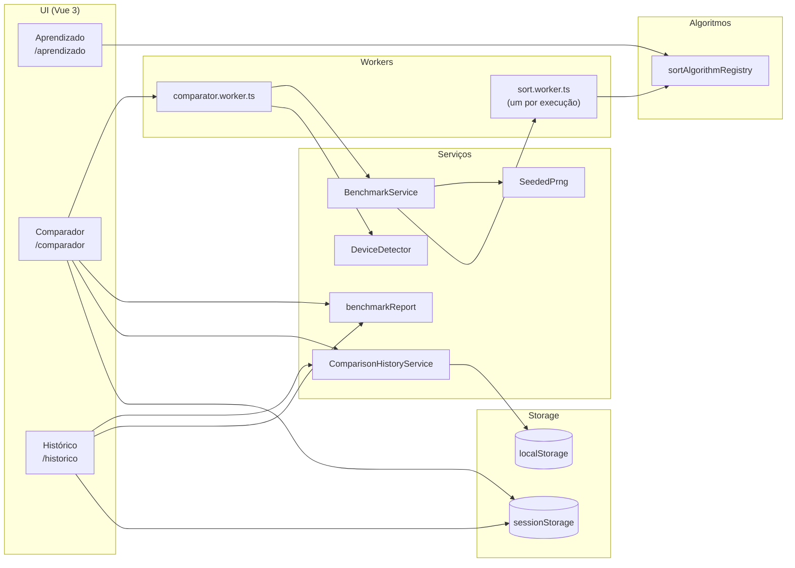

# ERS — Especificação de Requisitos de Software (Sorting Lab)

- Projeto: **Sorting Lab — Simulador Iterativo**
- Data: 2026-05-15
- Linguagem: pt-BR

## 1. Visão geral

### 1.1 Objetivo

O Sorting Lab é uma aplicação web executada localmente no navegador para:

1. **Ensinar algoritmos de ordenação** por meio de animações passo a passo, pseudocódigo e exposição de variáveis internas.
2. **Comparar algoritmos** com benchmark reproduzível (seed), métricas e execução assíncrona (Web Workers).
3. **Armazenar, reabrir e exportar** execuções para compartilhamento e acompanhamento de evolução.

### 1.2 Público-alvo (stakeholders)

- **Usuários finais (aprendizado)**: estudantes e curiosos.
- **Usuários avançados (benchmark)**: professores, devs, pesquisadores.
- **Mantenedores**: pessoas que vão adicionar algoritmos, ajustar métricas e evoluir UI/arquitetura.

### 1.3 Escopo

A aplicação se organiza em 3 módulos/telas (rotas):

- M1 — Aprendizado: `/aprendizado`
- M2 — Comparador: `/comparador`
- M3 — Histórico: `/historico`

Fora de escopo:

- Backend/servidor e autenticação (o processamento é local).
- Persistência remota.
- Medição “real” de memória do navegador (a memória reportada é uma **estimativa** de memória auxiliar da implementação).

### 1.4 Stack e bibliotecas

- UI: Vue 3 + TypeScript (strict) + Vite
- Design system: Ant Design Vue 4
- Gráficos: Chart.js via vue-chartjs
- PDF: jsPDF (lazy import)
- i18n: vue-i18n (pt-BR / en-US / es-ES)
- Concorrência: Web Workers
- Testes: Vitest + cobertura (thresholds 100% nos módulos-alvo)

## 2. Definições e glossário

- **Algoritmo**: uma implementação de ordenação acessível por uma chave (`AlgorithmKey`).
- **Cenário** (`ScenarioType`): distribuição do vetor de entrada:
  - `crescente`: [1..n]
  - `decrescente`: [n..1]
  - `aleatorio`: permutação Fisher-Yates determinística com seed
- **Célula**: combinação (algoritmo × cenário × tamanho) no benchmark.
- **Replicação**: repetição independente dentro de uma célula.
- **Seed base**: número informado pelo usuário e usado como raiz para derivar seeds por célula/replicação.
- **Timeout**: prazo máximo por replicação; ao estourar, a replicação é abortada.
- **Outlier**: amostra de tempo removida pelo método IQR (Tukey 1.5×IQR), quando habilitado.
- **Passo** (`SortStep`): snapshot do estado do array e variáveis internas usado para animação no módulo de Aprendizado.
- **Baseline score**: tempo (ms) de um loop fixo usado para contextualizar performance do dispositivo.

## 3. Arquitetura do sistema

### 3.1 Visão macro

A aplicação é uma SPA com 3 rotas e um pipeline de benchmark que evita travar a UI.

### 3.2 Decisão: Worker dedicado + sub-worker por execução

**Motivação**

- Benchmarks longos em JS podem bloquear o main thread e “congelar” a interface.
- Mesmo dentro de um Worker, uma execução pode ficar lenta demais; encerrar “no meio” via AbortSignal nem sempre é imediato (checagem é periódica).

**Solução implementada**

- `comparator.worker.ts` coordena o job (start/cancel/progress/result).
- `BenchmarkService` roda no worker e chama o registry de algoritmos.
- No comparador, o registry é substituído por `createSubWorkerRegistry()`, que executa cada sort dentro de um `sort.worker.ts` novo.

**Trade-offs**

- Mais overhead de criação de workers, mas maior robustez e melhor UX.

### 3.3 Contratos de dados (tipos principais)

- `SortRunResult`: `finalArray`, contadores (`comparisons`, `swaps`), `peakAuxBytes` (estimativa), `aborted`.
- `SortStep`: snapshots com `values`, `activeIndexes`, `variables` e campos específicos por algoritmo (pivot, heap region, runs do TimSort etc.).
- `CompareJob`: configuração do benchmark (algoritmos, cenários, tamanhos, replications, seed, timeout, outliers).
- `BenchmarkCell`: amostras brutas + médias por célula.
- `BenchmarkReport`: relatório completo com `cells`, `rows` e (opcional) `environment`.
- `ComparisonHistoryEntry`: histórico persistido com `config`, `rows`, `report` e metadados.

## 4. Requisitos

### 4.1 Módulo 1 — Aprendizado

**Histórias de usuário**

- HU-M1-01: Como estudante, quero ver o algoritmo ordenando passo a passo para entender o processo.
- HU-M1-02: Como estudante, quero controlar a velocidade e pausar/continuar para acompanhar.
- HU-M1-03: Como docente, quero que a UI mostre variáveis internas e pseudocódigo para conectar teoria e prática.

**Requisitos funcionais (RF)**

- RF-M1-01: Listar algoritmos disponíveis para estudo.
- RF-M1-02: Permitir vetor de entrada gerado por cenário (crescente/decrescente/aleatório) com limite de visualização.
- RF-M1-03: Permitir vetor de entrada manual (texto com separadores comuns).
- RF-M1-04: Executar e exibir animação passo a passo a partir de `SortStep[]`.
- RF-M1-05: Controles de execução: iniciar, pausar, continuar, reiniciar e navegar passo a passo (voltar/avançar).
- RF-M1-06: Controle de velocidade de 1× a 10×.
- RF-M1-07: Exibir índices começando em 1.
- RF-M1-08: Exibir variáveis internas (ex.: i/j/pivot) por passo.
- RF-M1-09: Exibir métricas básicas durante/ao fim da reprodução (tempo de playback, comparações, trocas).
- RF-M1-10: Exibir descrição (conceito/estratégia) e complexidades assintóticas (melhor/médio/pior) por algoritmo.

**Critérios de aceite (CA)**

- CA-M1-01: Para qualquer vetor válido, o resultado final exibido deve estar em ordem crescente.
- CA-M1-02: A troca de velocidade deve alterar o ritmo sem quebrar a ordem dos passos.
- CA-M1-03: Ao pausar e continuar, a reprodução deve manter a posição atual e atualizar as métricas.

### 4.2 Módulo 2 — Comparador

**Histórias de usuário**

- HU-M2-01: Como usuário avançado, quero comparar algoritmos em múltiplos cenários e tamanhos.
- HU-M2-02: Como pesquisador, quero resultados reproduzíveis com seed e entradas equivalentes.
- HU-M2-03: Como usuário, quero cancelar/limitar execuções longas sem travar a UI.

**Requisitos funcionais (RF)**

- RF-M2-01: Selecionar 1+ algoritmos para comparar.
- RF-M2-02: Selecionar 1+ cenários de entrada.
- RF-M2-03: Selecionar 1+ tamanhos de vetor (presets).
- RF-M2-04: Definir número de replicações por célula.
- RF-M2-05: Definir seed base para reprodutibilidade.
- RF-M2-06: Executar benchmark em thread separada (Web Worker) mantendo UI responsiva.
- RF-M2-07: Exibir progresso do job em tempo real (por célula concluída).
- RF-M2-08: Implementar timeout opcional por replicação, marcando timeouts sem bloquear a fila.
- RF-M2-09: Implementar remoção de outliers opcional via IQR (Tukey 1.5×IQR) para tempos.
- RF-M2-10: Calcular e exibir métricas agregadas por célula: tempo médio, comparações, trocas, memória auxiliar estimada e contagem de timeouts.
- RF-M2-11: Exibir resultados em tabela e gráfico.
- RF-M2-12: Exportar relatório (CSV/Markdown/PDF) do resultado da execução.

**Critérios de aceite (CA)**

- CA-M2-01: Algoritmos de uma mesma célula devem receber o mesmo vetor-base por replicação.
- CA-M2-02: Ao cancelar, o worker deve interromper o job e a UI deve refletir estado “cancelado”.
- CA-M2-03: Timeouts devem ser contabilizados e removidos das médias (tempo/contadores) sem interromper o restante do job.

### 4.3 Módulo 3 — Histórico

**Histórias de usuário**

- HU-M3-01: Como usuário, quero revisar execuções passadas sem repetir o benchmark.
- HU-M3-02: Como usuário, quero exportar/importar resultados para compartilhar.
- HU-M3-03: Como usuário, quero reabrir uma configuração do histórico no comparador.

**Requisitos funcionais (RF)**

- RF-M3-01: Persistir localmente execuções do comparador (localStorage).
- RF-M3-02: Listar execuções salvas, com distinção entre importadas e manuais.
- RF-M3-03: Favoritar execuções.
- RF-M3-04: Excluir uma execução e limpar histórico preservando favoritos.
- RF-M3-05: Exportar relatório (CSV/Markdown/PDF) quando disponível.
- RF-M3-06: Exportar gráfico em PNG.
- RF-M3-07: Importar CSV e reconstruir relatório para visualização.
- RF-M3-08: Reabrir uma execução (config) no comparador via sessionStorage.

**Critérios de aceite (CA)**

- CA-M3-01: Após recarregar a página, histórico deve ser restaurado quando storage estiver disponível.
- CA-M3-02: Importação deve rejeitar CSV inválido e comunicar erro ao usuário.

## 5. Regras de negócio

- RN-01: Toda ordenação é sempre **crescente**.
- RN-02: No comparador, algoritmos devem usar o mesmo vetor-base na mesma replicação (fairness).
- RN-03: Execuções abortadas por timeout não devem travar a fila; devem ser registradas.
- RN-04: Remoção de outliers segue uma única regra global (IQR 1.5×IQR) quando habilitada.
- RN-05: Histórico tem limite (padrão 20). Em falta de quota, descarta o mais antigo não-favorito primeiro.

## 6. Descrição detalhada dos serviços

### 6.1 `sortAlgorithmRegistry`

- Responsabilidade: mapa `AlgorithmKey` → `{ key, run }`.
- Uso:
  - Aprendizado chama `run` diretamente no main thread para obter `steps`.
  - Benchmark (via sub-worker) chama `run` com `recordSteps=false`.

### 6.2 `BenchmarkService`

- Responsabilidade: executar `CompareJob` e montar `BenchmarkReport`.
- Algoritmo (alto nível):
  - iterar cenários × tamanhos × algoritmos (células);
  - por célula, executar `replications` vezes;
  - gerar input determinístico (SeededPrng);
  - aplicar timeout via `deadlineMs` + `AbortController`;
  - coletar amostras (tempo/comparações/trocas/memória);
  - opcionalmente remover outliers de duração;
  - calcular médias e preencher `BenchmarkCell` e `rows`.

### 6.3 `SeededPrng`

- Responsabilidade: PRNG determinístico (Mulberry32) + helpers.
- Decisão: garantir reprodutibilidade e fairness com `deriveCellSeed`.

### 6.4 `DeviceDetector`

- Responsabilidade: capturar ambiente (UA parsing + hardware) e baseline.
- Observação: baseline é “grosso”; serve para contextualizar, não para normalizar automaticamente.

### 6.5 `benchmarkReport`

- Responsabilidade:
  - gerar relatório em Markdown e PDF;
  - gerar CSV seccionado com marcadores `# section:<nome>`;
  - fazer parse do CSV para reconstruir `BenchmarkReport`.

### 6.6 `ComparisonHistoryService`

- Responsabilidade: persistir histórico (localStorage) e “pending config” (sessionStorage).
- Política de quota:
  - escreve histórico ordenado;
  - ao exceder quota, remove o mais antigo não-favorito e tenta novamente (até limite).

## 7. Views (telas) e estados

### 7.1 Aprendizado

- Estados principais: preparado → pronto → rodando → pausado → concluído.
- Controles: preparar/gerar, iniciar, pausar, continuar, reset, passo-a-passo.
- Saídas: animação, pseudocódigo com tooltips, descrição e complexidade, métricas.

### 7.2 Comparador

- Validações: exige ao menos 1 algoritmo, 1 cenário, 1 tamanho; replicações ≥ 1; seed finita; timeout coerente quando habilitado.
- Execução: cria `comparator.worker.ts` (module worker) e faz streaming de progresso.
- Saídas: tabela (`ComparisonResultsTable`), gráfico (`ComparisonResultsChart`), exportações.

### 7.3 Histórico

- Dados: entradas manuais e importadas, ordenadas (importadas primeiro, depois favoritas, depois recentes).
- Ações: favoritar, excluir, limpar, importar CSV, exportar relatório, exportar PNG, reabrir no comparador.

## 8. Decisões técnicas e justificativas (resumo)

- **Sem backend**: evita fricção; favorece uso educacional.
- **Web Workers**: mantém UI fluida em benchmarks grandes.
- **Sub-worker por run**: cancelamento robusto e isolamento de execuções.
- **Seed determinística**: fairness e reprodutibilidade.
- **IQR**: método simples e comum para reduzir impacto de ruídos de execução.
- **Métricas instrumentadas**: contadores e estimativa de memória auxiliam a discussão didática.

## 9. Referências de implementação

- Rotas: `src/router/index.ts`
- Páginas: `src/pages/*Page.vue`
- Workers: `src/workers/*`
- Serviços: `src/services/*`
- Tipos: `src/types/*`
- Algoritmos: `src/algorithms/*`

## 10. Testes unitários e garantia de qualidade

O Sorting Lab utiliza **Vitest** como suíte de testes unitários. O objetivo não é “provar” formalmente a correção, mas **fixar contratos e invariantes** que impedem regressões nas partes críticas do simulador.

### 10.1 Organização

- `__tests__/algorithms/*`
  - valida **correção da ordenação** (sempre crescente), casos de borda (vazio, duplicatas etc.) e **imutabilidade** do input;
  - valida o contrato de `SortStep` (campos obrigatórios por passo), pois o módulo de Aprendizado depende disso para renderizar;
  - valida modo benchmark: `recordSteps=false`, contadores e estimativa de memória (`peakAuxBytes`), além de `AbortSignal` e `deadlineMs`.
- `__tests__/services/*`
  - `SeededPrng`: determinismo (`deriveCellSeed`) e geração de cenários (crescente/decrescente/aleatorio) para **fairness**;
  - `BenchmarkService`: reprodutibilidade com seed, emissão de progresso, cancelamento, timeout e remoção de outliers (IQR);
  - `benchmarkReport`: seções obrigatórias no CSV, round-trip `generate → parse`, validação de enums e independência de locale;
  - `ComparisonHistoryService`: SSR guard (sem `window`), persistência, limites, pending config e resiliência a storages nulos/malformados;
  - `sortAlgorithmRegistry`: completude do registry e forma do `SortRunResult` para todas as chaves.

### 10.2 Como os testes “garantem” o funcionamento

Na prática, os testes garantem o funcionamento ao **bloquear mudanças** que violariam os contratos usados pela UI e pelos serviços:

- O Aprendizado não quebra se cada passo seguir o shape esperado (`values`, `activeIndexes`, `variables`, contadores e campos do algoritmo).
- O Comparador permanece **reproduzível** e **justo** (mesma entrada por seed/célula/replicação) e trata cancelamento/timeout sem travar o job.
- O Histórico continua seguro em ambientes sem storage (ou SSR) e mantém as regras de limite/evicção.
- Exportar/importar relatórios via CSV continua consistente, inclusive ao trocar o idioma da interface.

### 10.3 Execução e cobertura

- Rodar testes:
  - `npm run test` (watch)
  - `npm run test:run` (execução única)
- Cobertura:
  - `npx vitest run --coverage`

O arquivo `vitest.config.ts` define um conjunto de módulos-alvo (algoritmos e serviços críticos) e thresholds de **100%** para linhas/funções/branches/statements **quando a execução de cobertura está habilitada**.
